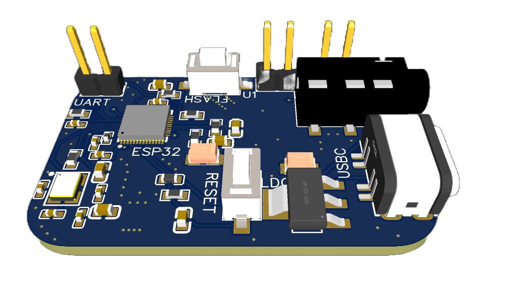

# audio32
ESP32-based, DIY, on-the-cheap HiFi multiroom audio solution for the smart home. Right now the module is using an ESP32-U4WDH SoC and a MAX98357 DAC+Amp board, which offers 3W audio output via the jack.
